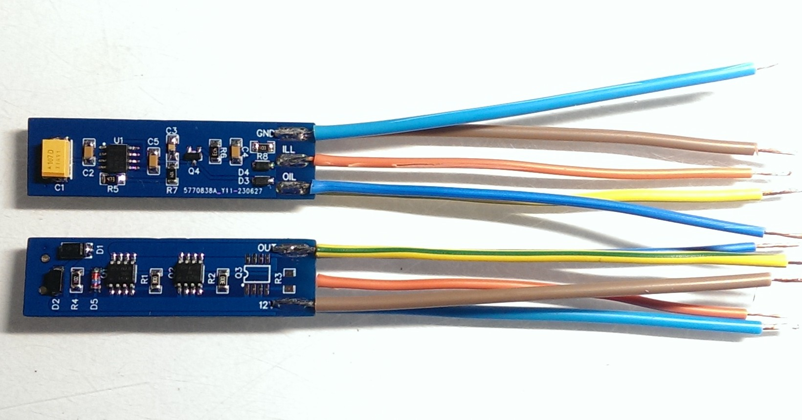

# Hardware development DRL for 30% High beam.

## Денні ходові вогні (ДХВ) 
Максимально проста і надійна схема, ніяких мікро контролерів. Вмикає дальнє світло приблизно на 30% потужності. Нічого не регулюється, нічого не збивається. Перевірена довгим досвідом на багатьох машинах.

ДХВ - це ваша безпека на дорозі! Про це написано досить багато. Дальнє світло більше усього для цього підходить. Із досвіду ставити більше 30% потужності дальнего не має сенсу. Не потрібно сліпити інших учасників руху.

> :warning: **Встановлюється на галогенні лампи** (рекомендовано стандартні на 60Вт).

> :warning: **Не підходить для ксенону!**

> :warning: **На LED лампах може працювати не корректно!**

> :warning: **Живлення 12В!**

> :warning: **Керування по плюсу!**

### Має 5 проводів на виході:

> :memo: **Товстий коричневий** - підключити через запобіжник на 5-10А на провід запалювання. Рекомендовано після реле запалювання. На ньому повинно з'являтися 12В при вмиканні запалювання.

> :memo: **Товстий голубий** - підключити на корпус (мінус)

> :memo: **Жовтий з полосою** - підключити до ламп дальнього світла, напряму. Повинен підключатися саме на провід до ламп після реле дальнього світла.

> :memo: **Тонкий червоний** - підключається до габаритів. При вмиканні габаритів ДХВ вимикається. Це трапляється якщо на цей провід подати 12В.

> :memo: **Тонкий голубий** - підключається до аварійної лампи тиску масла або до ручного гальма. Якщо цей провід підключити до корпуса (мінус) - ДХВ вимикається.

Якщо все підключено правильно, то при вмиканні запалювання ДХВ не вмикається якщо горить лампа тиску масла (тонкий голубий підключено до лампи тиску масла), але вмикається після запуску двигуна (лампа масла гасне) - дуже зручно. Якщо вмикається габаритне світло - ДХВ вимикається. Блок ДХВ не заважає блимати дальнім світлом!

___Плата перевірена та працює справно!___

## Принципова схема пристрою

## Зібрана плата ДХВ
 

Для любителів самостійного складання:
1. [Гербер](production/Gerber_PCB_DHO_2023-06-27.zip) файл для замовлення основної плати
2. [BOM](production/BOM_PCB_PCB_DHO_2023-06-27_2023-07-17.xlsx) файл деталей 
